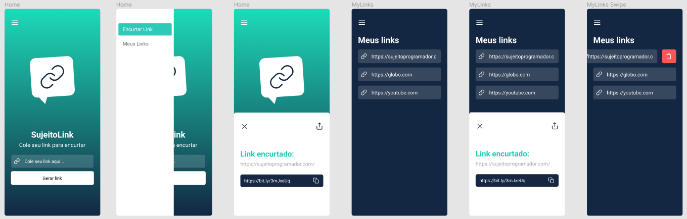

<h1 align="center">SujeitoLink</h1>

  

## Project

During the Fullstack Week 3.0 event we developed this mobile application for shortening links. The application consumes an API to shorten the links. The shortened links are saved on the user's cell phone, so he can view it whenever he wants.

## Technologies/Libraries

This project was developed with the following technologies/libraries:

- [React Native](https://reactnative.dev/)
- [Expo](https://expo.io/)
- [Bitly](https://bitly.com/)
- [AsyncStorage](https://docs.expo.io/versions/latest/sdk/async-storage/)

## How to run

- Go to the [Bitly](https://bitly.com/) website and register, then log in
- Go to Your User Name -> Profile Settings -> Generic Access Token, enter your password and click the "GENERATE TOKEN" button
- Clone the repository
- Access project directory
- Install dependencies with `yarn`
- Enter your token in the KEY variable: `./src/services/api.js` 
- Start the expo with `expo start`, `yarn start` or `npm start`

## License

This project is under the MIT license. See the [LICENSE](LICENSE.md) file for more details.